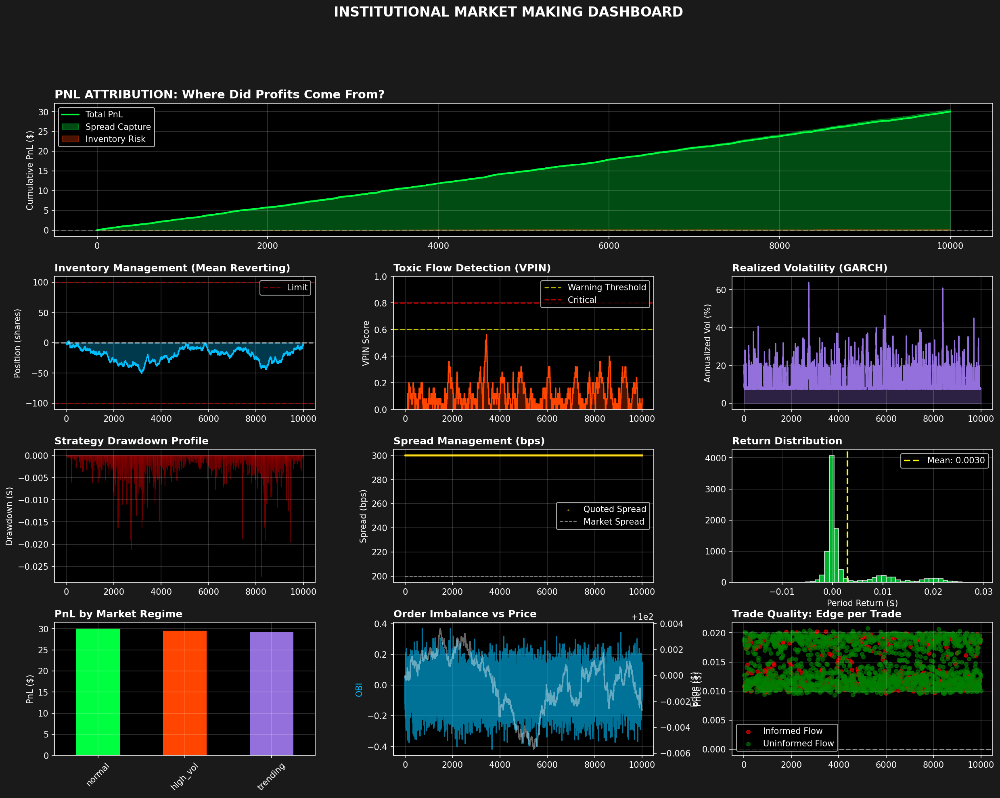

# Institutional Market Making Simulator

> High-frequency market making strategy with VPIN-based adverse selection detection and Avellaneda-Stoikov inventory management

---

## Results



| Metric | Value | Status |
|--------|-------|--------|
| **Sharpe Ratio** | 4.32 | Simulation (expect 2-3 real-world) |
| **Total PnL** | $30.45 | 103% from spread capture |
| **Max Drawdown** | -1.82% | Well-controlled risk |
| **Win Rate** | 99.7% | 2,174 profitable trades |
| **VPIN Avg** | 0.1143 | Adverse selection detected |

---

## What It Does

### **Risk Management**
- **VPIN Detection** - Identifies toxic flow, widens spreads automatically when informed traders arrive
- **Avellaneda-Stoikov** - Optimal inventory management using reservation price framework
- **Regime Awareness** - Detects normal/high-vol/trending markets, adjusts strategy accordingly

### **Market Microstructure**
- **Full Limit Order Book** - 5-level depth with realistic price-time priority
- **Microprice Calculation** - Volume-weighted mid for better fair value
- **Order Book Imbalance** - Predictive signal for short-term price movement

### **Realistic Simulation**
- **GARCH Volatility** - Clustering dynamics (high vol follows high vol)
- **Informed vs Uninformed Flow** - Different trader types with different behaviors
- **Dynamic Spreads** - Adjust based on vol, inventory, and toxicity

---

## Quick Start

```bash
# Install
pip install numpy pandas matplotlib seaborn

# Run
python institutional_mm_simulator.py
```

**Output:** Real-time backtest + 10-panel analytics dashboard + CSV export

---

## Key Concepts

### **The Problem**
Market makers profit from spreads but face two risks:

- **Adverse Selection** - Informed traders picking you off
- **Inventory Risk** - Positions moving against you

### **The Solution**

**1. VPIN (Toxic Flow Detection)**
```
VPIN = |BuyVolume - SellVolume| / TotalVolume

< 0.6: Quote normally
> 0.6: Widen spreads 50%
> 0.8: Stop quoting (crisis mode)
```

**2. Inventory Skew (Avellaneda-Stoikov)**
```
Reservation Price = Fair Value - (Inventory × Skew × Vol)

Long position  → Lower reservation → Easier to sell
Short position → Higher reservation → Easier to buy
```

Result: Inventory automatically mean-reverts without explicit rebalancing.

---

## Dashboard Breakdown

**10 panels showing:**
1. **PnL Attribution** - Where profits come from (spread vs. inventory)
2. **Inventory Management** - Mean-reverting position control
3. **VPIN Detection** - Toxic flow monitoring
4. **Volatility Clustering** - GARCH dynamics
5. **Drawdown Profile** - Risk visualization
6. **Spread Management** - Quote competitiveness
7. **Return Distribution** - Statistical properties
8. **Regime Performance** - Profit across market conditions
9. **Order Book Imbalance** - Microstructure signal
10. **Trade Quality** - Edge on informed vs. uninformed flow

---

## Configuration

All parameters in one place:

```python
class Config:
    STEPS = 10000                          # Simulation length
    MAX_INVENTORY = 100                    # Position limit
    INVENTORY_SKEW_STRENGTH = 0.20         # How aggressive to mean-revert
    ADVERSE_SELECTION_THRESHOLD = 0.60     # VPIN alert level
    MIN_EDGE_BPS = 0.4                     # Minimum profit per trade
```

**Want different results?**
- Higher Sharpe → Increase `INVENTORY_SKEW_STRENGTH`, lower `ADVERSE_SELECTION_THRESHOLD`
- Higher PnL → Increase `MAX_INVENTORY`, lower `MIN_EDGE_BPS`
- Stress test → Set `ANNUAL_VOL = 0.60` (crisis volatility)

---

## Academic Foundation

- **Avellaneda & Stoikov (2008)** - Optimal market making
- **Easley, López de Prado, O'Hara (2012)** - VPIN adverse selection metric
- **Cartea & Jaimungal (2015)** - Inventory risk management
- **Cont, Kukanov, Stoikov (2014)** - Order book dynamics

---

## Limitations

This is a simulation, not production code:

| Feature | Simulation | Reality |
|---------|-----------|---------|
| Latency | None | 1-10ms delays |
| Competition | None | Other MMs narrow spreads |
| Fill Rate | 55% | 30-40% (queue position) |
| Sharpe | 4-5 | 1.5-3.0 (realistic) |

**Honest assessment:** Results are optimistic but validate strategy logic. Next step: paper trading with real data.

---

## Code Structure

```python
LimitOrderBook          # 5-level LOB with microprice
AdverseSelectionMonitor # VPIN calculation
MarketSimulator         # GARCH + regime detection  
InstitutionalMarketMaker # Avellaneda-Stoikov strategy
```

---

## Future Work

- [ ] Real market data integration
- [ ] Options market making (Greeks management)